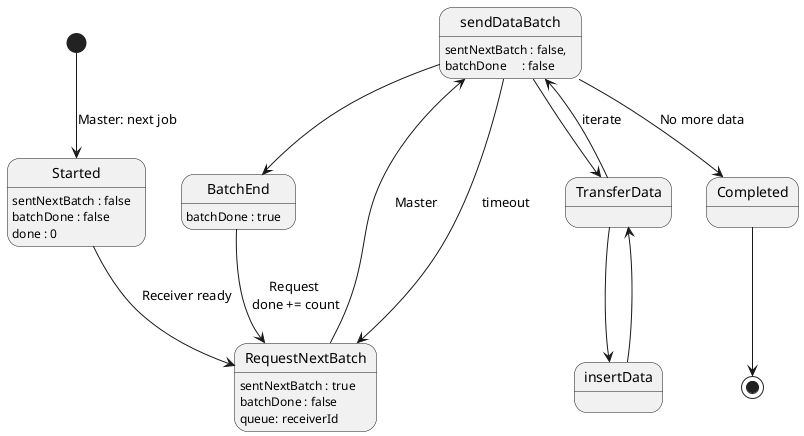

```plantuml
@startuml

[*] --> Started: Master: next job
Started: sentNextBatch : false
Started: batchDone : false
Started: done : 0

Started --> RequestNextBatch: Receiver ready
RequestNextBatch: sentNextBatch : true
RequestNextBatch: batchDone : false
RequestNextBatch: queue: receiverId

RequestNextBatch --> sendDataBatch: Master 
sendDataBatch: sentNextBatch : false,
sendDataBatch: batchDone     : false

sendDataBatch -> TransferData
TransferData --> insertData
insertData --> TransferData

TransferData --> sendDataBatch: iterate
sendDataBatch --> BatchEnd
BatchEnd: batchDone : true

sendDataBatch --> RequestNextBatch: timeout

BatchEnd --> RequestNextBatch: Request\n done += count

sendDataBatch --> Completed: No more data
Completed --> [*]

@enduml
```