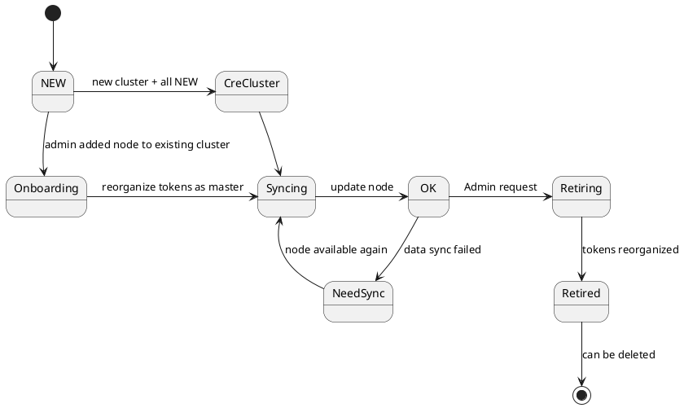
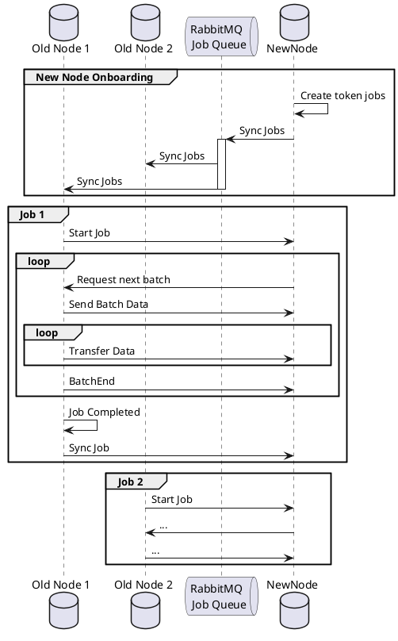
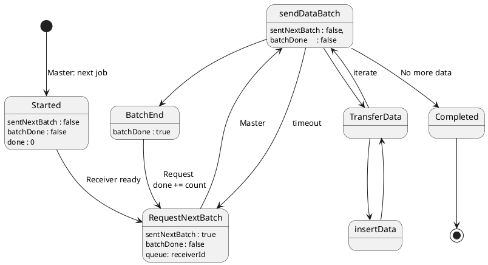

# Design Objectives
1. replication always to 2 different nodes
  - (x + 1) and (x + 2) partitions are on different nodes
2. nodes should have equal partition count
3. adding a node should only move partitions to a node
  - i.e. no other partition movement required

# Replica Node Status

 

# Final Optimized Scenario

- "M" = master
- "S" = replica slave
- "+" = token added
- "x" = token deleted
- "&gt;" = role changed 

"12 / 4" = node stored 12 token (master + replica) and had 4 storage tasks to perform

            Token:
            0  1  2  3  4  5  6  7  8  9  a  b  c  d  e  f
    Node 0 M  S  S  M  S  S  M  S  S> M  S  S  M  S  S> M     < 16 / 0
    Node 1 S  M  S> S  S> S> S  M  S  S  M  S> S  M  S  S     < 16 / 0
    Node 2 S+ S+ M+ S+ M+ M+ S+ S+ M+ S+ S+ M+ S+ S+ M+ S+    < 16 / 16

            Token:
            0  1  2  3  4  5  6  7  8  9  a  b  c  d  e  f
    Node 0 M   x S  S> S  S  M  S  M<  x S  S  M   x  x S>    < 12 / 4
    Node 1 S  M   x S  S   x S   x S  M<  x S  S  M  M< S     < 12 / 4
    Node 2 S  S  M   x  x M  S  M< S> S  M<  x S  S  S>  x    < 12 / 4
    Node 3    S+ S+ M+ M+ S+    S+    S+ S+ M+    S+ S+ M+    < 12 / 12

            Token:
            0  1  2  3  4  5  6  7  8  9  a  b  c  d  e  f
    Node 0 M      x S  S  S  M   x M      x S  S>       S     < 9 / 3
    Node 1 S  M      x S     S  M+ S  M      x S  M   x S     < 10 / 4
    Node 2 S  S  M         x S  S> S  S  M      x S  M<       < 10 / 2
    Node 3    S  S  M   x M<    S     S  S  M     S  S   x    < 10 / 2
    Node 4       S+ S+ M+ S+             S+ S+ M+    S+ M+    < 9 / 9

            Token:
            0  1  2  3  4  5  6  7  8  9  a  b  c  d  e  f
    Node 0 M         x S  S  M     M         x S  S+ S+ S     < 9 / 4
    Node 1 S  M         x S+ S  M  S  M         x S>    S     < 9 / 3
    Node 2 S  S  M           S  S  S  S  M         x  x       < 8 / 2
    Node 3    S  S  M      x    S     S  S  M      x  x       < 7 / 3
    Node 4       S  S  M   x             S  S  M     M<  x    < 7 / 2
    Node 5          S+ S+ M+                S+ S+ M+ S+ M+    < 8 / 8

            Token:
            0  1  2  3  4  5  6  7  8  9  a  b  c  d  e  f
    Node 0 M            x S  S> M+ M            x S  S  S     < 8 / 3
    Node 1 S  M            x S  S> S  M            x S+ S     < 8 / 3
    Node 2 S  S  M            x S  S  S  M                    < 7 / 1
    Node 3    S  S  M            x    S  S  M                 < 6 / 1
    Node 4       S  S  M                 S  S  M      x       < 6 / 1
    Node 5          S  S  M                 S  S  M   x  x    < 6 / 2
    Node 6             S+ S+ M+                S+ S+ M+ M+    < 7 / 7

            Token:
            0  1  2  3  4  5  6  7  8  9  a  b  c  d  e  f
    Node 0 M               x S  S> M               x S  S     < 6 / 2
    Node 1 S  M               x S  S  M               x S     < 6 / 2
    Node 2 S  S  M               x S  S  M                    < 6 / 1
    Node 3    S  S  M                 S  S  M                 < 6 / 0
    Node 4       S  S  M                 S  S  M              < 6 / 0
    Node 5          S  S  M                 S  S  M           < 6 / 0
    Node 6             S  S  M                 S  S  M   x    < 6 / 1
    Node 7                S+ S+ M+                S+ S+ M+    < 6 / 6

The tasks will be performed in batched in request/responses via RMQ:

 

*Remark: Each batch message contains an array of documents.*

States are identified by:

@enduml

[[main.md|Back to index]]